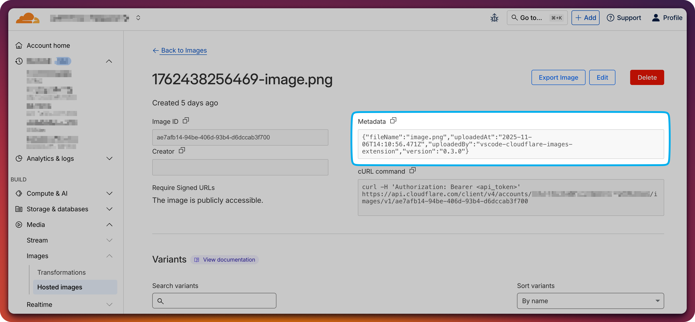

# Cloudflare Images Upload for VSCode

> Upload images to Cloudflare Images with drag & drop, paste, or command palette - automatically inserts the right syntax for your file type.

## Features

- **🖱️ Drag & Drop**: Drag image files from your file explorer directly into any supported file
- **📋 Paste from Clipboard**: Copy images from anywhere (screenshots, browsers, image editors) and paste into your document
- **⌨️ Command Palette**: Use the command palette to select and upload images
- **🎨 Smart Syntax**: Automatically inserts the correct syntax based on file type:
  - **Markdown**: ``
  - **HTML/PHP/Vue/Svelte**: ``
  - **CSS/SCSS/Sass/Less**: `url('url')`
  - **JavaScript/TypeScript/React**: `"url"`
  - **Python/Ruby/Go/Rust/Java/C/C++/C#**: `"url"`
  - **JSON**: `"url"`
  - **Plain Text**: Raw URL
- **⚡ Progress Notifications**: Real-time upload progress feedback
- **🔍 Smart Duplicate Detection**: Automatically detects and reuses previously uploaded images (no redundant uploads!)
- **🏷️ Automatic Metadata Tagging**: Tags uploaded images with extension info for easy tracking and management
- **🗑️ Optional Delete on Removal**: Ask to delete from Cloudflare when removing image URLs (disabled by default)
- **🌐 Multi-Format Support**: Works in 25+ file types including Markdown, HTML, CSS, JavaScript, TypeScript, Python, and more

> **Built with Windsurf**: This extension was developed using [Windsurf](https://codeium.com/windsurf) and Claude Sonnet 4.5.
>
> **Read the story**: [How I built this extension with the help of Claude](https://mdias.info/posts/vibecoding-vscode-extension-into-existence/) - A blog post about the development process and lessons learned.

## 🎬 Features in Action

### Drag & Drop Upload


### Copy & Paste Upload


### Smart Duplicate Detection


### Delete on Removal (Optional)


### Automatic Metadata Tagging
All uploaded images are automatically tagged with metadata for easy tracking:



The metadata includes:
- **uploadedBy**: Identifies images from this extension
- **version**: Extension version used
- **uploadedAt**: Timestamp of upload
- **fileName**: Original filename

## 📦 Installation

### From Marketplace

**VSCode Marketplace** (for VSCode):
1. Open VSCode
2. Go to Extensions (`Ctrl+Shift+X` or `Cmd+Shift+X`)
3. Search for "Cloudflare Images Upload"
4. Click Install

**Open VSX Registry** (for Windsurf, VSCodium, and other VSCode alternatives):
1. Open your editor (Windsurf, VSCodium, etc.)
2. Go to Extensions
3. Search for "Cloudflare Images Upload"
4. Click Install

Or install directly from:
- [VSCode Marketplace](https://marketplace.visualstudio.com/items?itemName=miguelcaetanodias.cloudflare-images-upload)
- [Open VSX Registry](https://open-vsx.org/extension/miguelcaetanodias/cloudflare-images-upload)

### From VSIX

1. Download the `.vsix` file from [Releases](https://github.com/mcdays94/cloudflare-images-upload-extension/releases)
2. Open your editor
3. Go to Extensions → `...` menu → Install from VSIX
4. Select the downloaded file

## Configuration

Before using the extension, you need to configure your Cloudflare credentials:

1. Open VSCode Settings (`Ctrl+,` or `Cmd+,`)
2. Search for "Cloudflare Images Upload"
3. Configure the following:

| Setting | Description | How to Get It |
|---------|-------------|---------------|
| **Account ID** | Your Cloudflare Account ID | Dashboard → Any domain → Overview (right sidebar) |
| **API Token** | API token with Images:Edit permission | Dashboard → My Profile → API Tokens → Create Token |
| **Account Hash** | Your Cloudflare Images account hash | Dashboard → Images → Copy from URL: `/images/[HASH]` |
| **Default Variant** | Image variant for URLs (optional) | Default: `/public` |

### Getting Your API Token

1. Go to [Cloudflare Dashboard](https://dash.cloudflare.com/)
2. Click on your profile → API Tokens
3. Click "Create Token"
4. Use the "Edit Cloudflare Images" template
5. Or create a custom token with `Account.Cloudflare Images:Edit` permission
6. Copy the token and paste it in the extension settings

## Usage

### Method 1: Drag & Drop

1. Open a markdown file (`.md`)
2. Drag an image file from your file explorer
3. Drop it where you want the image
4. ✨ Done! The image uploads and a markdown link is inserted

### Method 2: Paste from Clipboard

1. Copy an image to your clipboard:
   - Take a screenshot (`Cmd+Shift+4` on Mac, `Win+Shift+S` on Windows)
   - Copy an image from a browser (right-click → Copy Image)
   - Copy from an image editor
2. Open a markdown file
3. Paste (`Ctrl+V` or `Cmd+V`)
4. ✨ Done! The image uploads and a markdown link is inserted

### Method 3: Command Palette

1. Open a markdown file
2. Open Command Palette (`Ctrl+Shift+P` or `Cmd+Shift+P`)
3. Type "Upload Image to Cloudflare"
4. Select an image file
5. ✨ Done! The image uploads and a markdown link is inserted

### Real world use-case

I use it heavily when writing blog posts. Going from screenshot to published image in seconds.


## Supported Image Formats

- PNG (`.png`)
- JPEG (`.jpg`, `.jpeg`)
- GIF (`.gif`)
- WebP (`.webp`)
- BMP (`.bmp`)
- SVG (`.svg`)

## Requirements

- **VSCode**: Version 1.80.0 or higher
- **Cloudflare Account**: With Cloudflare Images enabled
- **API Token**: With `Images:Edit` permission

## Example Output

The extension automatically inserts the correct syntax based on your file type. Here are some examples:

**Markdown (.md):**
```markdown

```

**HTML (.html):**
```html

```

**CSS (.css):**
```css
url('https://imagedelivery.net/YOUR_HASH/IMAGE_ID/public')
```

**JavaScript/TypeScript:**
```javascript
"https://imagedelivery.net/YOUR_HASH/IMAGE_ID/public"
```

The image is immediately accessible via Cloudflare's global CDN!

## Use Cases

- **Documentation**: Quickly add screenshots to your README files
- **Blog Posts**: Upload images while writing markdown blog posts
- **Notes**: Add images to your markdown notes
- **Technical Writing**: Include diagrams and screenshots in technical docs
- **GitHub Issues**: Upload images for bug reports

## Development

### Building from Source

```bash
# Clone the repository
git clone https://github.com/mcdays94/cloudflare-images-upload-extension.git
cd cloudflare-images-upload-extension

# Install dependencies
npm install

# Compile TypeScript
npm run compile

# Package the extension
npm run package
```

### Project Structure

```
cloudflare-images-upload/
├── src/
│   └── extension.ts       # Main extension code
├── out/                   # Compiled JavaScript
├── extension_icon.png     # Extension icon
├── package.json          # Extension manifest
├── tsconfig.json         # TypeScript config
└── README.md            # This file
```

## Contributing

Contributions are welcome! Please feel free to submit a Pull Request.

1. Fork the repository
2. Create your feature branch (`git checkout -b feature/AmazingFeature`)
3. Commit your changes (`git commit -m 'Add some AmazingFeature'`)
4. Push to the branch (`git push origin feature/AmazingFeature`)
5. Open a Pull Request

## License

This project is licensed under the MIT License - see the [LICENSE](LICENSE) file for details.

## ☕ Support This Project

If you find this extension helpful and it saves you time, consider buying me a coffee! Your support helps keep this project maintained and improved.

[](https://buymeacoffee.com/miguelcaetanodias)

## 📊 Release Notes

### 0.4.0

- ✅ **Automatic Metadata Tagging**: Uploaded images are tagged with extension info (version, filename, timestamp) for easy tracking
- ✅ **Optional Delete on Removal**: Ask to delete images from Cloudflare when removing URLs (disabled by default)
- ✅ **Smart Tracking**: Tracks recently inserted images for 5 minutes to detect removals
- ✅ **Configurable**: Both features can be enabled/disabled in settings

### 0.3.0

- ✅ **Smart Duplicate Detection**: Automatically detects previously uploaded images using SHA-256 hashing
- ✅ **Persistent Cache**: Stores image hashes locally (30-day retention) to avoid redundant uploads
- ✅ **User Notifications**: Shows friendly messages when duplicates are detected
- ✅ **Performance**: Instant duplicate detection with no API calls required

### 0.2.0

- ✅ Enhanced multi-language support
- ✅ Improved syntax formatting for different file types

### 0.1.0 (Initial Release)

- ✅ Drag & drop image upload
- ✅ Paste image from clipboard
- ✅ Command palette upload
- ✅ Automatic markdown link insertion
- ✅ Progress notifications
- ✅ Support for PNG, JPG, GIF, WebP, BMP, SVG

---

### Note

While I work at Cloudflare, this is a personal side project I built independently. It's not an official Cloudflare product and isn't affiliated with, endorsed by, or supported by Cloudflare, Inc.
